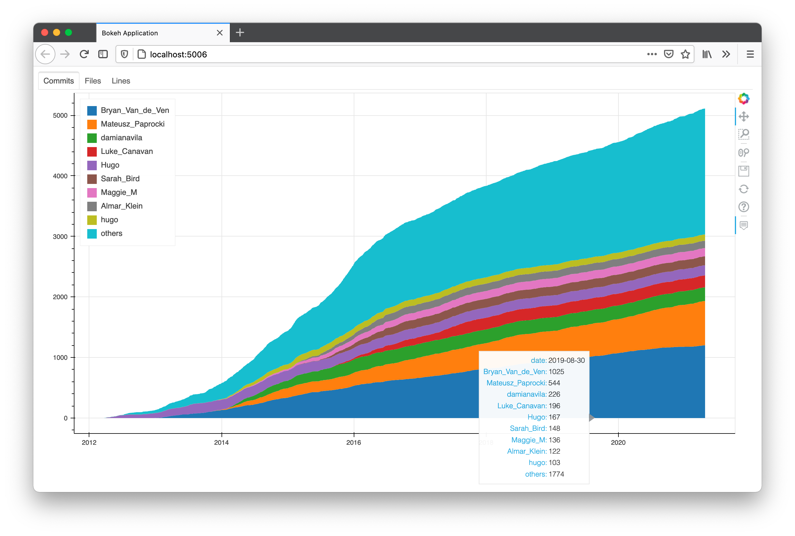

# When Who Coded

`whenwhocoded` looks into the entire commit history of a Git repository, and visualises the amount of contribution (commits / files changed / lines changed) with [Bokeh](https://docs.bokeh.org/en/latest/index.html).

## Installation

A [conda](https://docs.conda.io/en/latest/) environment YAML is available under `environments`.

```
> pip install .[dev]
Obtaining file:///Users/libo/Scripts/whenwhocoded
...
Successfully installed whenwhocoded
> whenwhocoded
usage: whenwhocoded [-h] [-l LIMIT] [-i [INCLUDE_FILES ...]] [-e [EXCLUDE_FILES ...]] [-c] repo
whenwhocoded: error: the following arguments are required: repo
```

## Usage

`whenwhocoded` accepts the following arguments via CLI:

- `-l/--limit`: Number of top contributers to visualise. Others are combined into 'other'. Defaults to 9.
- `-i/--include-files`: File extensions to include, e.g. `-i .py .js`.
- `-e/--exclude-files`: File extensions to exclude, e.g. `-e .csv`.
- `-c/--use-cache`: Use the repo history cache from the last run. Specifying this flag invalidates `-i` and `-e`.

## Example

We try to analyse the contribution to `.py`, `.js`, `.ts`, and `.html` files in the Bokeh repo. The repo was cloned on Saturday, 24 April 2021.

```
whenwhocoded /Users/libo/Scripts/bokeh -i .py .ts .js .html
2021-04-25 22:50:42,829 — INFO — repo_history:29:make_diff_suffix — Created git diff suffix: '*.py' '*.ts' '*.js' '*.html'
100%|################################| 15861/15861 [03:34<00:00, 73.91it/s]
```

Querying the entire commit history takes a few minutes. Once done, the bokeh server opens up `localhost:5006` in a browser window. Note the three tabs for different metrics of contribution:



The commit history of specified file tpyes is cached in `path/to/repo/commit_history.csv`. To reuse the cache:

```
> whenwhocoded /Users/libo/Scripts/bokeh --use-cache
2021-04-25 22:56:29,878 — INFO — repo_history:16:logged_fetch_cache — Using cache file. include_files and exclude_files are ignored.
```

The same window will pop up.
